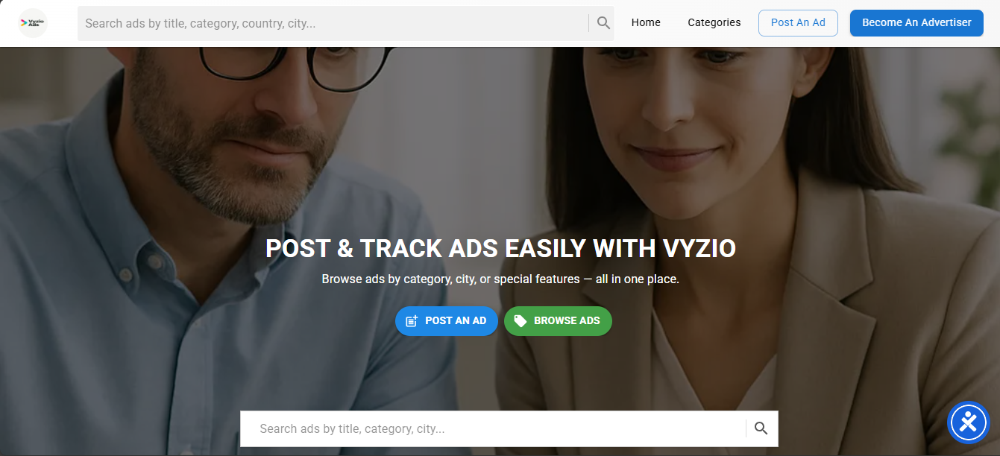

# Vyzio.com

## Objective of the Project

The main objective of the Vyzio.com project is to build a modern, intuitive, and accessible web platform that allows users to post and browse ads related to:

- Services (e.g., plumbing, hairdressing, transportation)
- Products (buying and selling items)
- Job offers (posting or seeking jobs)
- Business or training opportunities

### Key Goals

- **Help Users Gain Visibility**  
  Freelancers, small vendors, and job seekers can promote themselves or their services.

- **Free Browsing for Visitors**  
  Anyone can browse ads without creating an account.

- **Ad Posting for Registered Advertisers**  
  Only registered users can post ads. They must pay a small fee to publish.

- **Simplified Ad Workflow**  
  Ad posting is broken down into steps:  
  1. Choose category  
  2. Fill out ad details  
  3. Upload images  
  4. Add contact info  
  5. Make payment  
  6. Publish

- **Secure On-Site Payments**  
  Support for:  
  - Stripe (Cards : Visa, MasterCard, etc.)  
  - Mobile Money (Orange, Moov, Mobicash)  
  - Crypto (BTC, ETH, USDT)

- **Responsive, Modern UX**  
  Works smoothly on desktop, tablet, and mobile.

- **Admin Control Panel**  
  For full management of:  
  - Ads  
  - Users  
  - Payments  
  - Platform statistics

### Summary

To create a self-sustaining ad platform where visitors browse freely, and advertisers pay to gain exposure — all while maintaining security, simplicity, and responsiveness.

## Features

| Feature                          | Model or Implementation Needed         | Notes                         |
|---------------------------------|---------------------------------------|-------------------------------|
| Categories (organized by type)   | `Category` model                      | Better than plain choices      |
| Payments                        | `Payment` model                       | Link ad + user + amount + status |
| Multiple photos per ad          | `AdImage` model (FK to Ad)            | Support multiple uploads       |
| Filters by location, price     | Query logic + DB indexes              | No new model needed            |
| Contact via WhatsApp/email      | Extra fields or `Contact` model       | Optional                      |
| Crypto, card, mobile payments  | Extra fields in Payment model          | payment method, currency, crypto_address |
| Advertiser Dashboard           | Views + filtering logic                | No new model                  |
| Admin Dashboard               | Aggregate stats from models             | No new model                  |
| Location-based browsing        | Use city or CountryField                | For filtering                 |
| Comments or Contact Messages    | Optional `Message` model               | Enables user-to-user chat     |

---